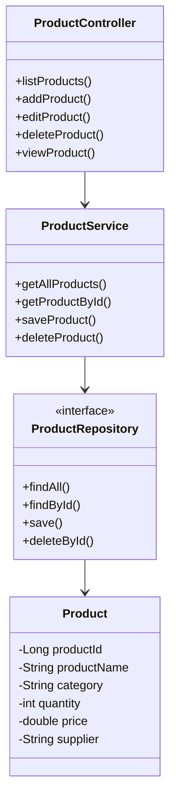

# Inventory System UML Class Diagram
This diagram represents the core architecture of the inventory system using a Controller → Service → Repository pattern.

```mermaid
classDiagram
    class Product {
        -Long productId
        -String productName
        -String category
        -int quantity
        -double price
        -String supplier
    }

    class ProductController {
        +listProducts()
        +addProduct()
        +editProduct()
        +deleteProduct()
        +viewProduct()
    }

    class ProductService {
        +getAllProducts()
        +getProductById()
        +saveProduct()
        +deleteProduct()
    }

    class ProductRepository {
        <<interface>>
        +findAll()
        +findById()
        +save()
        +deleteById()
    }

    ProductController --> ProductService
    ProductService --> ProductRepository
    ProductRepository --> Product
```
